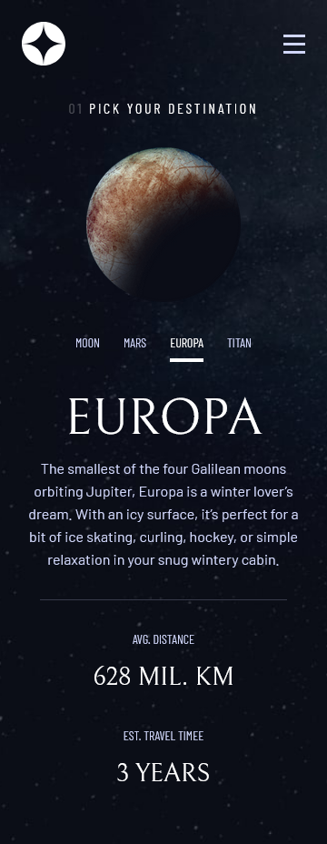

# Frontend Mentor - Space tourism website solution

A multi-page space tourism website. This is a solution to the [Space tourism website challenge on Frontend Mentor](https://www.frontendmentor.io/challenges/space-tourism-multipage-website-gRWj1URZ3). Frontend Mentor challenges help you improve your coding skills by building realistic projects. 


## Table of contents

- [Overview](#overview)
  - [The challenge](#the-challenge)
  - [Screenshot](#screenshot)
  - [Links](#links)
- [My process](#my-process)
  - [Built with](#built-with)
- [Author](#author)
- [Project Setup](#project-setup)


## Overview

### The challenge

Users should be able to:

- View the optimal layout for each of the website's pages depending on their device's screen size
- See hover states for all interactive elements on the page
- View each page and be able to toggle between the tabs to see new information

### Screenshot

<details>
<summary>Screenshot</summary>



</details>

### Links

- [Solution]()
- [Live Site]()

## My process

### Built with

- Vue.js
- Semantic HTML5 markup
- Mobile-first workflow
- Tailwindcss


## Author

- Frontend Mentor - [@guytito](https://www.frontendmentor.io/profile/guytito)
- Twitter - [@i_jollof](https://www.twitter.com/i_jollof)


## Project Setup

```sh
npm install
```

### Compile and Hot-Reload for Development

```sh
npm run dev
```

### Compile and Minify for Production

```sh
npm run build
```
